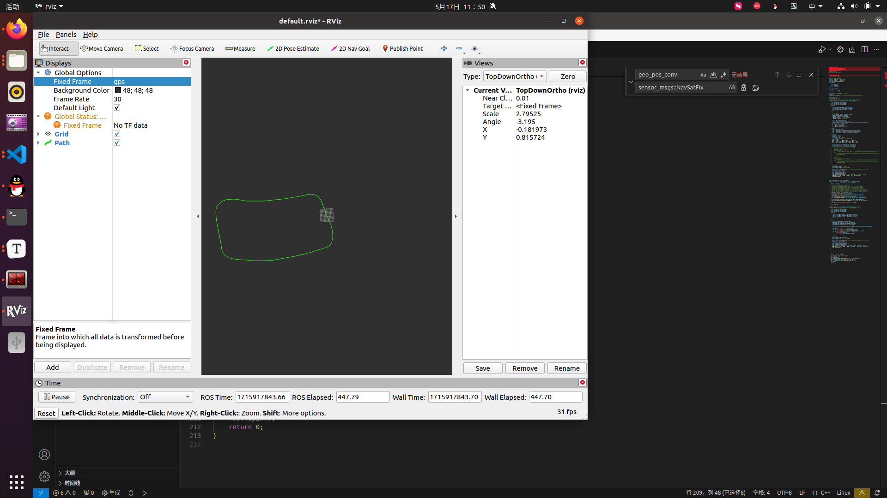

# GPS经纬度坐标转化为ENU坐标

* step1  编译GeographicLib 库函数，GeographicLib库函数源文件放在third_party文件夹下，可通过脚本build_third_party .sh 编译 

* step2  编译ros工作空间 并启动节点

```
  cd catkin_ws
  catkin_make
  rosrun gps_bag_pkg gps_bag_node
```

  step3  通过gps_bag_pkg功能包中的data文件夹中的bag包测试

```
rosbag play out_test_rtk.bag 
```


